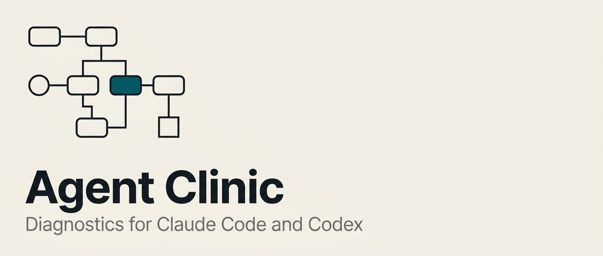

# Agent Clinic



Diagnostics for agent-assisted work. Each one is a separate plugin, and you install only the ones you want.

| Plugin | Use it when | Needs |
| --- | --- | --- |
| **Session Doctor** | A session went badly and you want to know why. | Nothing |
| **Outcome Doctor** | A plan, design, or diff may be more or less than the job needs, and you want a second opinion before you build it. | A TypeSafe API key |

Both report what they found and leave the fixes to you. Neither one edits your code.

Add the marketplace once:

```text
/plugin marketplace add shinpr/agent-clinic
```

```sh
codex plugin marketplace add shinpr/agent-clinic
```

## Session Doctor

Looks back at one of your past Claude Code or Codex sessions and tells you what to change.

Sessions go wrong for boring reasons. A request with no "done" condition. A task that quietly vanished at a compaction. A skill that overrode one of your own rules. Session Doctor reads the saved transcript and looks for problems like these:

- **What you asked for**: where the request left the outcome, scope, or "done" undefined.
- **How the work was run**: work the agent started but never finished, state lost during compaction, subagent results that were never checked.
- **What was instructing the agent**: your skills, `AGENTS.md` and `CLAUDE.md` as they actually combined in that session, including rules that conflict or duplicate each other when they apply at the same time.

The three passes run separately, so a hunch from the first does not bias the other two. The report shows what went wrong, where it happened, and the smallest change likely to prevent it next time.

### Install

```text
/plugin install session-doctor@agent-clinic
```

```sh
codex plugin add session-doctor@agent-clinic
```

Start a new session afterwards so the skill is loaded.

### Use

```text
/recipe-diagnose   # Claude Code
$recipe-diagnose   # Codex
```

The examples below use the Claude Code form.

The place to start is the session that just went sideways. Run it with no argument: it finds the most recent session for the current repository and asks you to confirm it before analysing. You can also name one directly:

```text
/recipe-diagnose look at session 01af3c2e-...
/recipe-diagnose the session in ~/.claude/projects/my-repo/01af3c2e-....jsonl
```

The argument is plain language, not a fixed syntax. Installed in either host, it reads both Claude Code and Codex transcripts.

By default the report covers every problem it can back with evidence. If you want it limited to the problems that contributed to the failure, say so. "Just the root causes" is enough.

### Picking the session

You rarely need an ID. Tell it roughly when the session ran and what you were working on, and it searches the saved transcripts for a match. It confirms with you before it starts:

```text
/recipe-diagnose the session last night where the test suite kept half-passing
```

When you already know which session you want:

- **Read its ID**: open the session and run `/status`. Both CLIs show the ID, as do the Code tab in the Claude desktop app and Codex in the ChatGPT app. Copy it, then start Session Doctor in a different session and give it that ID.
- **Drag it in**: in the ChatGPT app, switch to Codex and drag the session's title from the sidebar into the chat box. The title goes in as a chip that points at that session.

## Outcome Doctor

Agents write code that is technically correct and larger than the job. So do we. The version check nobody asked for, the cache for a file that gets read once, the config flag with no caller. It all looks defensible while you are writing it, and a reviewer who calls it out is arguing taste against taste.

Outcome Doctor judges against the outcome you stated. Tell it what you want the thing to do, hand it the plan or the diff, and it comes back with one of five readings per decision: sufficient, excessive, insufficient, mixed, or not enough evidence to say. Work that falls short gets reported as readily as work that overshoots, which is the part that "keep it minimal" advice cannot do.

Each verdict carries no authority on its own. It arrives with the evidence behind it, and you decide whether that evidence holds.

### Setup

Classification runs on a model from [TypeSafe AI](https://typesafe.ai/), so this one needs an API key of your own. What leaves your machine is the case you are asking about: the outcome, the facts you supplied, and the change being judged. See [TypeSafe's pricing](https://typesafe.ai/) for what a run costs.

Create a key in the [TypeSafe dashboard](https://console.typesafe.ai/), then export it:

```sh
export TYPESAFE_API_KEY="your-api-key"
```

Then install:

```text
/plugin install outcome-doctor@agent-clinic
```

```sh
codex plugin add outcome-doctor@agent-clinic
```

Start a new session afterwards so the skill is loaded.

### Use

```text
/recipe-rightsize   # Claude Code
$recipe-rightsize   # Codex
```

Point it at whatever you are about to accept or build:

```text
/recipe-rightsize is this design doc bigger than it needs to be? docs/design/search.md
/recipe-rightsize review says to add a version preflight. worth it?
/recipe-rightsize judge this diff against "the CLI reports failures with the exit code"
```

Say what you want out of the change, in your own words. Everything gets measured against it, so a vague goal gives you a vague answer. Leave it out and it will ask.

One input reliably makes the answer worse: a design document handed over as the requirement. Its arguments for its own additions become the goal, and the proposal is then measured against itself. Say what you want in your own words, and pass the document as the thing being judged.

## License

MIT
